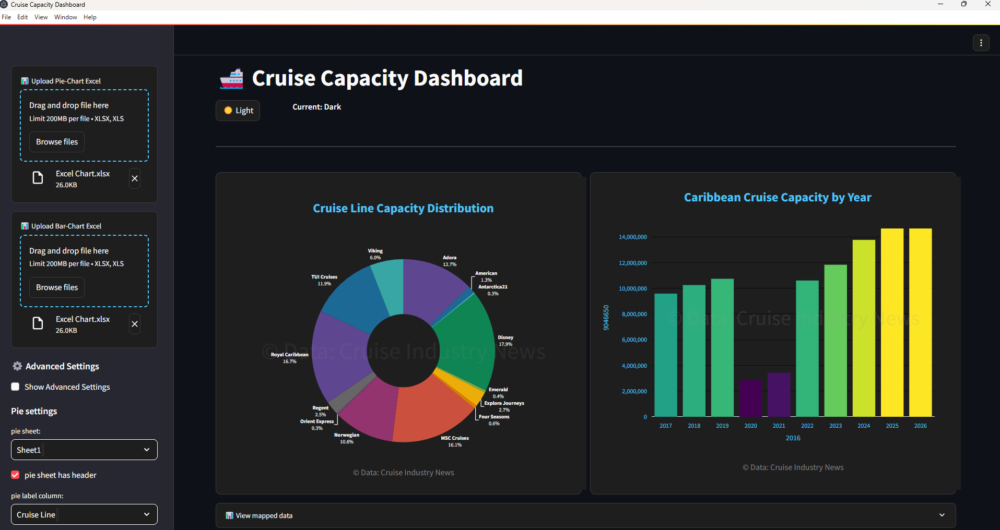

# Cruise Capacity Dashboard

&gt; A professional, offline-ready desktop tool for visualizing cruise-industry capacity data.

---

## Overview
Cruise Capacity Dashboard is a **no-code** desktop application that turns any Excel file into interactive Pie and Bar charts.  
Built with Streamlit and packaged via Stlite/Electron, it ships as a single Windows installer—no Python, no dependencies, no internet required.

---

## Features
| Feature | Benefit |
|---------|---------|
| **Drag-and-Drop Excel Loader** | Accepts any `.xlsx` file—no pre-formatting needed. |
| **Sheet-Aware UI** | Pick one sheet for Pie charts, another for Bar charts. |
| **Auto-Clean Engine** | Strips currency symbols, commas, stray headers, blank rows. |
| **Dynamic Mapping** | Point & click to assign columns → axes / labels / values. |
| **Interactive Charts** | High-DPI Pie & Bar charts with hover tooltips and auto-scaling. |
| **Branding Kit** | Add logo, watermark, copyright footer for client-ready exports. |
| **Offline-First** | Runs completely offline—ideal for shipboard or secure environments. |

---

## Quick Start
1. **Download** `Cruise-Dashboard-Setup-1.0.0.exe` (≈ 120 MB).
2. **Install** → double-click → accept Windows Defender prompt (“More info → Run anyway”).
3. **Launch** via desktop shortcut.

That’s it—no Python, pip, or virtual-env headaches.

---

## Data Guidelines
| Chart Type | Required Columns | Typical Headers |
|------------|------------------|-----------------|
| **Pie** | Label, Value | `Cruise Line`, `Capacity` |
| **Bar** | X-Axis, Y-Axis | `Year`, `Capacity` |

&gt; **Tip:** If headers aren’t in row 1, use the sidebar “Header Row” spinner to adjust.

---

## Keyboard Shortcuts
| Key | Action |
|-----|--------|
| `Ctrl + O` | Open file dialog |
| `Ctrl + R` | Reset all mappings |
| `Ctrl + S` | Save current view as PNG |

---

## License & Support
*Proprietary – all rights reserved.*  
For support, email `support@cruisedashboard.com`.

---